# YSRun

## 易瘦跑步 iOS客户端

一款记录跑步数据的App。

### 界面及功能

#### 主界面

显示总体数据，如运动次数、距离等。可连接发送心率数据的蓝牙设备，使用标准蓝牙协议，连接后心率数据实时显示，并作为运动过程中的数据参考。

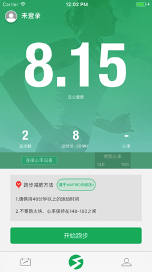

#### 运动界面

实时显示当前运动时间、距离、平均配速。地图展示运动路径。操作按钮可暂停或结束当前运动。

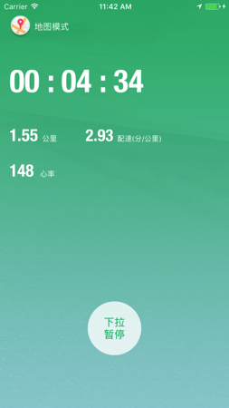
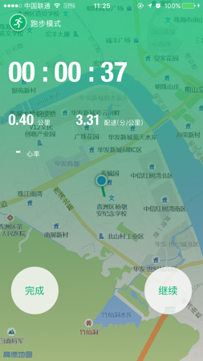

#### 运动完成界面

运动完成后显示本次记录信息并进行相应评分。点击地图右上角按钮可查看本次运动的详细信息。

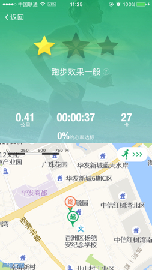

#### 运动记录界面

+	**轨迹**：运动的路径，日期信息，所用时间
+	**详情**：数据详情
+	**配速**：每公里配速及平均配速
+ 	**心率**：运动过程中的心率数据及区间分析

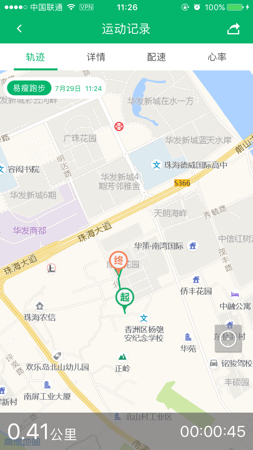
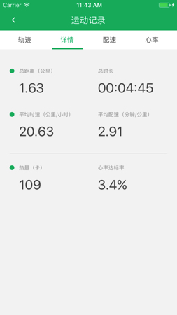
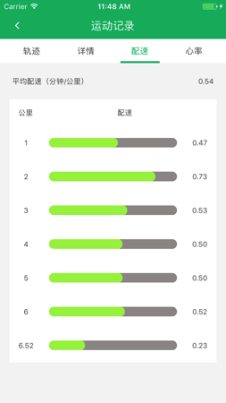
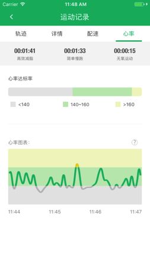

#### 日历界面

显示每天运动情况，查看某一天的运动数据。

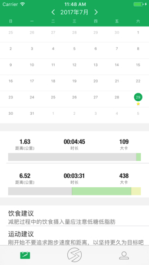

#### 用户界面

记录用户相关信息，登录后运动数据可同步到云端进行备份。

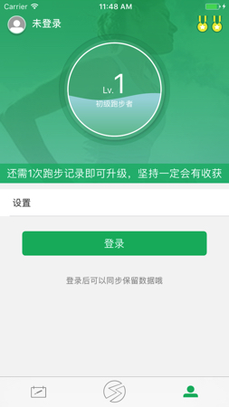

#### 设置界面

可关闭主界面的心率显示。设置运动过程中的语音提示。

#### 登录和注册界面

支持手机注册登录和第三方登录。注册时通过手机验证码验证注册。

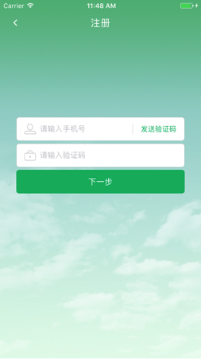

### 其他

下载完项目直接XCode打开工程文件运行即可。

[项目代码上的一些说明可以看这里](http://moshuqi.github.io/2016/06/02/App项目说明/)

**PS.** 服务器已过期，和网络相关的代码应该都已失效。
